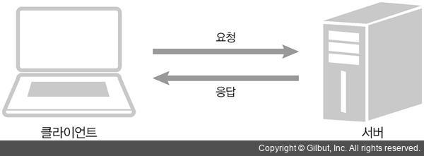
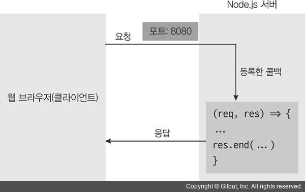
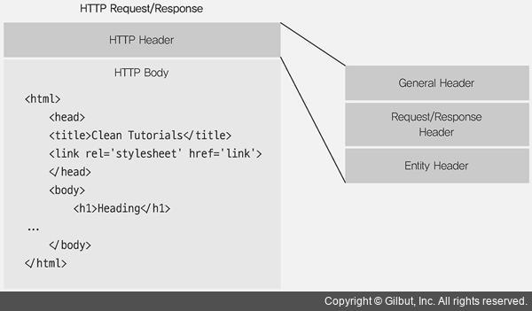
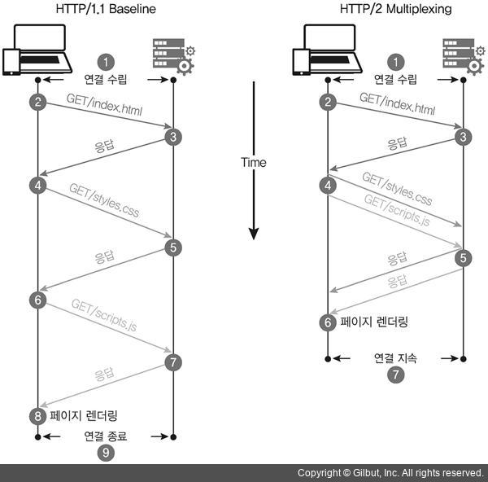

# http 모듈로 웹 서버 만들기

[4.1 요청과 응답 이해하기](#41-요청과-응답-이해하기)

[4.2 쿠키와 세션 이해하기](#42-쿠키와-세션-이해하기)

[4.3 REST API와 라우팅](#43-REST-API와-라우팅)

[4.4 https와 http2](#44-https와-http2)

[4.5 cluster](#45-cluster)

[4.6 함께 보면 좋은 자료](#46-함께-보면-좋은-자료)


## 4.1 요청과 응답 이해하기




### client와 server의 관계

- 클라이언트에서 서버로 요청을 보내고, 서버에서는 요청의 내용을 읽고 처리한 뒤 클라이언트에게 응답한다.

- 서버에는 요청을 받는 부분과 응답을 보내는 부분이 있어야 합니다.

- 클라이언트로부터 요청이 왔을 때 어떤 작업을 수행할지 이벤트 리스너를 미리 등록


#### http Module

- createServer 메서드
  - 인자로 요청에 대한 콜백 함수를 받음
  - 요청이 들어올 때마다 매번 콜백 함수가 실행
  - 콜백 함수에 응답 작성
  - req와 res 매개변수
    - req 객체는 요청에 관한 정보
    - res 객체는 응답에 관한 정보
  - res 객체
    -  res.write와 res.end 존재
    - res.write의 첫 번째 인자는 클라이언트로 보낼 데이터
    - res.end는 응답을 종료하는 메서드





```js
// fs 모듈로 html 파일을 반환
const http = require('http');
const fs = require('fs');

http.createServer((req, res) => {
  // fs 모듈로 html 파일을 반환
  fs.readFile('./server2.html', (err, data) => {
    if (err) {
      throw err;
    }
    res.end(data);
  });
}).listen(8081, () => {
  console.log('8081번 포트에서 서버 대기 중입니다!');
});

```


## 4.2 쿠키와 세션 이해하기

##### 클라이언트에서 보내는 요청의 단점

- 누가 요청을 보내는지 모른다는 것
-  IP 주소나 브라우저의 정보를 받아올 수는 있으나, 여러 컴퓨터가 공통으로 IP 주소를 가지거나, 한 컴퓨터를 여러 사람이 사용할 수도 있다.
- 로그인을 구현하면 해결 -> 쿠키와 세션에대해 공부


##### 쿠키

- name=zerocho 같이 단순한 ‘키-값’의 쌍
- 클라이언트
  - 서버로부터 쿠키가 오면 웹 브라우저는 쿠키를 저장해두었다가 요청할 때마다 쿠키를 동봉해서 전송
  - 브라우저는 쿠키가 있다면 자동으로 동봉해서 보내주므로 따로 처리 안함
- 서버
  - 클라이언트 요청에 들어 있는 쿠키를 읽어서 요청자가 누구인지 파악
  - 브라우저로 쿠키를 보낼 때만 코드를 작성
  - 미리 클라이언트에 요청자를 추정할 만한 정보를 쿠키로 만들어 보내고, 그 다음부터는 클라이언트로부터 쿠키를 받아 요청자를 파악
- 쿠키는 요청과 응답의 헤더에 저장


##### 헤더와 본문




##### 세션

서버에 사용자 정보를 저장하고 클라이언트와는 세션 아이디로만 소통


## 4.3 REST API와 라우팅

##### REST API

https://www.slideshare.net/Byungwook/rest-api-60505484


##### HTTP METHOD

> GET: 서버 자원을 가져오고자 할 때 사용합니다. 요청의 본문(body)에 데이터를 넣지 않습니다. 데이터를 서버로 보내야 한다면 쿼리스트링을 사용합니다.
>
> POST: 서버에 자원을 새로 등록하고자 할 때 사용합니다. 요청의 본문에 새로 등록할 데이터를 넣어 보냅니다.
>
> PUT: 서버의 자원을 요청에 들어 있는 자원으로 치환하고자 할 때 사용합니다. 요청의 본문에 치환할 데이터를 넣어 보냅니다.
>
> PATCH: 서버 자원의 일부만 수정하고자 할 때 사용합니다. 요청의 본문에 일부 수정할 데이터를 넣어 보냅니다.
>
> DELETE: 서버의 자원을 삭제하고자 할 때 사용합니다.


## 4.4 https와 http2

##### HTTPS

https 모듈은 웹 서버에 SSL 암호화를 추가

GET이나 POST 요청을 할 때 오고 가는 데이터를 암호화해서 중간에 다른 사람이 요청을 가로채더라도 내용을 확인할 수 없게 해줍니다

CreateServer -> CreateSecureServer 사용




## 4.5 cluster

- cluster 모듈은 싱글 스레드인 노드가 CPU 코어를 모두 사용할 수 있게 해주는 모듈

- 포트를 공유하는 노드 프로세스를 여러 개 둘 수도 있어 요청이 많이 들어왔을 때 병렬로 실행된 서버의 개수만큼 요청이 분산

- 세션을 공유하지 못하는 등의 단점
  - Redis 등의 서버를 도입하여 해결할 수 있습니다.
- 실무에서는 pm2 등의 모듈로 cluster 기능을 사용

##### 마스터 프로세스

- CPU 개수만큼 워커 프로세스를 만들고 워커 프로세스에 요청을 분배

##### 워커 프로세스가 

- 실질적인 일을 하는 프로세스

