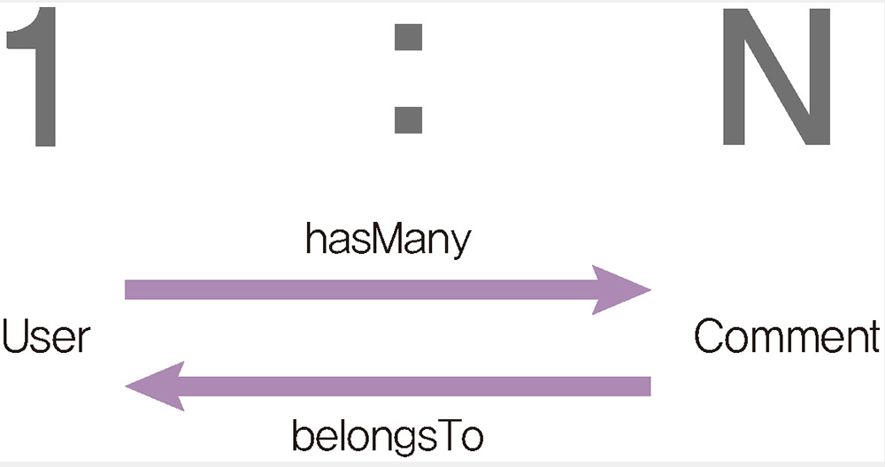
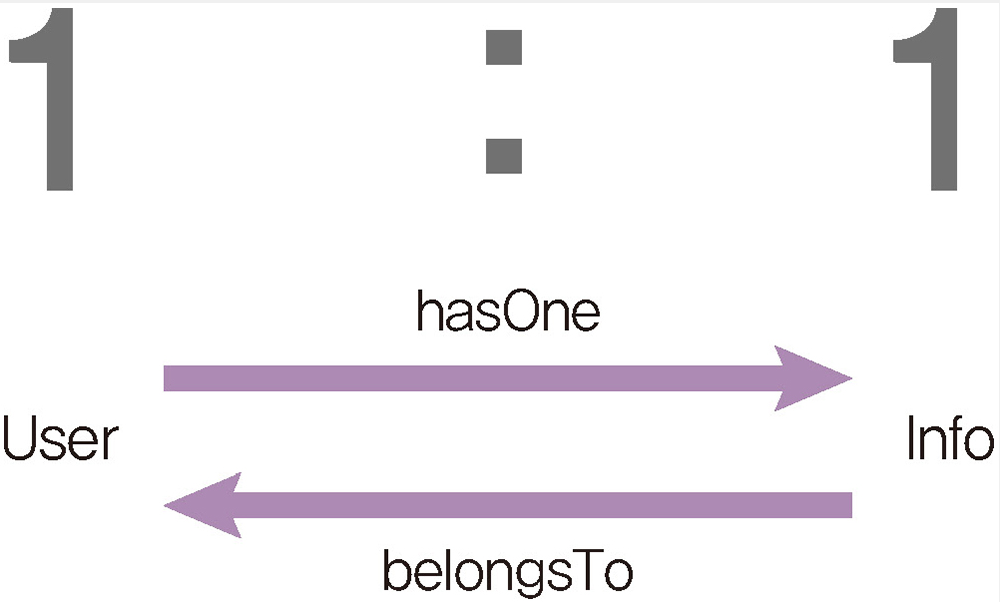
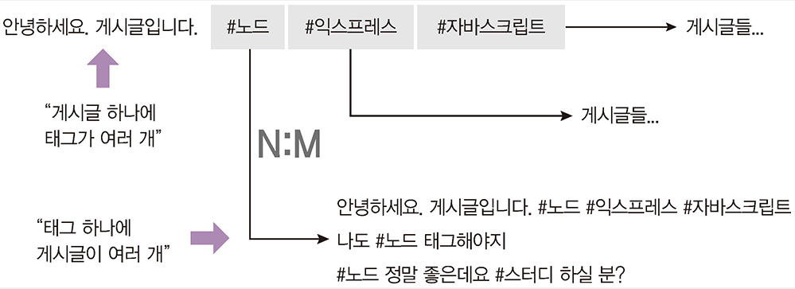

# MySQL

[7.1 데이터베이스란?](#71-데이터베이스란?)
[7.2 MySQL 설치하기](#72-MySQL-설치하기)
[7.3 워크벤치 설치하기](#73-워크벤치-설치하기)
[7.4 데이터베이스 및 테이블 생성하기](#74-데이터베이스-및-테이블-생성하기)
[7.5 CRUD 작업하기](#75-CRUD-작업하기)
[7.6 시퀄라이즈 사용하기](#76-시퀄라이즈-사용하기)
[7.7 함께 보면 좋은 자료](#77-함께-보면-좋은-자료)

---


데이터를 변수에 저장한다는 것은 컴퓨터 메모리에 저장했다는 뜻

서버가 종료되면 메모리가 정리되며 저장한 데이터도 사라진다.


## 7.1 데이터베이스란?

데이터 베이스는 관련성을 가지며 중복이 없는 데이터의 집합

데이터베이스를 관리하는 시스템을  DBMS라고 부른다.


## 7.2 MySQL 설치하기

실습으로 생략

## 7.3 워크벤치 설치하기

실습으로 생략

## 7.4 데이터베이스 및 테이블 생성하기

실습으로 생략

## 7.5 CRUD 작업하기


User Table 만들기

```sql
CREATE TABLE nodejs.users (
id INT NOT NULL auto_increment,
name varchar(255) not null,
age INT UNSIGNED not null,
married TINYINT not null,
comment TEXT null,
create_at datetime not null default now(),
primary key(id),
unique index name_unique (name asc))
COMMENT = '사용자 정보'
default charset=utf8
engine=InnoDB;
```

Comment Table 만들기

```sql
CREATE TABLE nodejs.comments (     
 id INT NOT NULL AUTO_INCREMENT,     
 commenter INT NOT NULL,     
 comment VARCHAR(100) NOT NULL,     
 created_at DATETIME NOT NULL DEFAULT now(),     
 PRIMARY KEY(id),     
 INDEX commenter_idx (commenter ASC),     
 CONSTRAINT commenter     
 FOREIGN KEY (commenter)     
 REFERENCES nodejs.users (id)     
 ON DELETE CASCADE     
 ON UPDATE CASCADE)     
 COMMENT ='댓글'     
 DEFAULT CHARSET=utf8     
 ENGINE=InnoDB;
```


데이터 입력하기

```sql
INSERT INTO nodejs.users (name, age, married, comment) VALUES ('zero', 24, 0,'자기소개1');
INSERT INTO nodejs.users (name, age, married, comment) VALUES ('nero', 32, 1,'자기소개2');

INSERT INTO nodejs.comments (commenter, comment) VALUES (1,'안녕하세요. zero의 댓글입니다');
```


## 7.6 시퀄라이즈 사용하기

시퀄라이즈는 ORM (Object-relational Mapping) 으로써,

자바스크립트 객채와 데이터베이스의 릴레이션을 매핑해주는 도구


문법이 호환되기 때문에 다른 SQL 데이터베이스로 전환할 때도 편리하다.


자바스크립트 구문을 알아서 SQL로 바꿔준다.


```bash
express learn-sequelize --view=pug

cd learn-sequelize
npm i sequelize mysql2
npm i -g sequelize-cli

sequelize init
```


```js
const path = require('path');
const Sequelize = require('sequelize');
const env = process.env.NODE_ENV || 'development';
const config = require(path.join(__dirname, '..', 'config', 'config.json'))[env];
const db = {};
const sequelize = new Sequelize(config.database, config.username, config.password, config);
db.sequelize = sequelize;
db.Sequelize = Sequelize;
module.exports = db;

```


## 모델 정의하기

### User 모델 정의

```js
module.exports = (sequelize, DataTypes) => {
	return sequelize.define(
		'user',
		{
			name: { type: DataTypes.STRING(20), allowNull: false, unique: true },
			age: { type: DataTypes.INTEGER.UNSIGNED, allowNull: false },
			married: { type: DataTypes.BOOLEAN, allowNull: false },
			comment: { type: DataTypes.TEXT, allowNull: true },
			created_at: { type: DataTypes.DATE, allowNull: false, defaultValue: sequelize.literal('now()') },
		},
		{ timestamps: false }
	);
};

```


### Comment 모델 정의

```js
module.exports = (sequelize, DataTypes) => {
	return sequelize.define(
		'comment',
		{
			comment: { type: DataTypes.STRING(100), allowNull: false },
			created_at: { type: DataTypes.DATE, allowNull: true, defaultValue: sequelize.literal('now()') },
		},
		{ timestamps: false }
	);
};

```


시퀄라이즈는 id를 기본키로 연결한다.

sequilize.define 메서드로 테이블명과 각 컬럼의 스펙을 입력합니다.

MySQL 테이블과 컬럼의 내용이 일치해야 정확하게 대응됩니다.


시퀄라이즈의 자료형

>VARCHAR -> STRING
>
>INT -> INTEGER
>
>TINYINT -> BOOLEAN
>
>DATETIME -> DATE
>
>INT UNSIGNED -> INTGER.UNSIGNED
>
>INT UNSIGNED ZEROFILL-> INTGER.UNSIGNED.ZEROFILL
>
>NOT NULL -> allowNull
>
>UNIQUE -> unique
>
>DEFAULT -> defaultValue


시퀄라이즈의 테이블 옵션

timestamps 속성의 값

- true -> create_at, update_at 자동으로 추가


## 관계 정의하기

### 1:N

user -> comment

하나의 유저가 여러개의 comment를 작성할 수 있다.




### 1:1




### N:M




### 쿼리 알아보기

```js
//INSERT INTO nodejs.users (name, age, married, comment) VALUES ('zero', 24, 0,'자기소개1'); 

const { User } = require('../models') 

User.create({   name:'zero',   age: 24,   married: false,   comment:'자기소개1', });
```


```js
//SELECT * FROM nodejs.users; 
User.findAll({});     

```


```js
//SELECT * FROM nodejs.users; 
User.findOne({});     

```


```js
//SELECT name, married FROM nodejs.users; 
User.findAll({   attributes: ['name','married'], });
```


```js
//SELECT name, age FROM nodejs.users WHERE married = 1 AND age > 30; 

const { User, Sequelize: { Op } } = require('../models'); 

User.findAll({
    attributes: ['name','age'], 
    where: {                                                               married: 1,     
      age: { [Op.gt]: 30 },   
           }, 
});     
```


## 7.7 함께 보면 좋은 자료